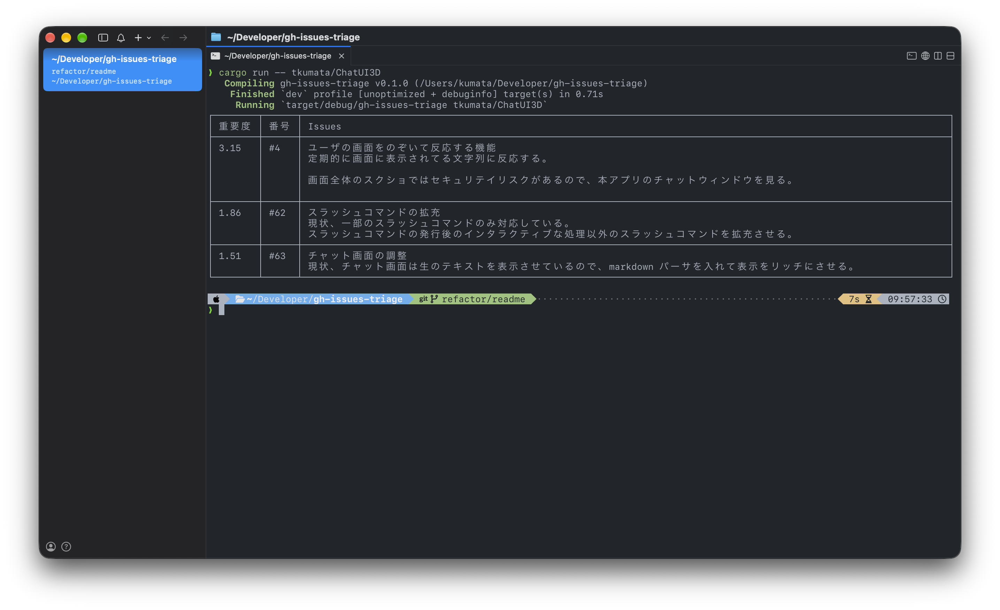

# GitHub Issues Triage

GitHub Issues の最新10件を取得し、Jev で重要度順に並べる CLI ツールです。

## Components

```text
               ┌─────────────────────┐
               │     GitHub App      │
               │                     │
               │ Client ID           │
               │ Permissions         │
               │ Installation        │
               └──────────┬──────────┘
                          │ enables
                          ▼
               ┌─────────────────────┐
               │     Device Flow     │
               │                     │
               │ User authorization  │
               │ Access token        │
               │ Refresh token       │
               └──────────┬──────────┘
                          │ access token
           ┌──────────────┴──────────────┐
           ▼                             ▼
┌─────────────────────┐       ┌─────────────────────┐
│   GitHub REST API   │       │  GitHub GraphQL API │
│                     │       │                     │
│ Issues              │       │ Issues              │
│ Repositories        │       │ Repositories        │
│ Users               │       │ Projects            │
└──────────┬──────────┘       └──────────┬──────────┘
           └──────────────┬──────────────┘
                          │ Issue data
                          ▼
               ┌─────────────────────┐
               │  gh-issues-triage   │
               └──────────┬──────────┘
                          │ Issue content
                          ▼
               ┌─────────────────────┐
               │        Jev          │
               │                     │
               │ Importance scoring  │
               └──────────┬──────────┘
                          │ Scores
                          ▼
               ┌─────────────────────┐
               │    Ranked Issues    │
               └─────────────────────┘
```

private repository を使う場合は、GitHub App を対象 repository に install し、App の `Issues: Read` 権限を設定してください。

## Environment

- Rust
- `reqwest` crate
- `GITHUB_CLIENT_ID`: GitHub App client ID（token 更新と Device Flow 用）
- `TYPESAFE_API_KEY`: TypeSafe Jev API key（Issue triage 用）

GitHub 公式 REST API を使って認証とデータの取得を行います。

## How to Use

```shell
export GITHUB_CLIENT_ID='<GitHub App client ID>'
export TYPESAFE_API_KEY='<TypeSafe API key>'
cargo run -- gh-username/gh-reponame
```

認証情報がない場合は Device Flow の確認 URL とコードを表示します。認証情報は macOS Keychain または Linux Secret Service に保存されます。保存済み access token が失効した場合は refresh token で自動更新し、refresh token がないか失効している場合だけ Device Flow を開始します。PAT と平文ファイルは使用しません。

repository 指定では、GitHub の open Issue を新しい順に最大10件取得し、pull request を除外します。全 Issue を1回の TypeSafe Jev リクエストで重要度判定とブランチ名の分類を行い、端末幅に合わせた Unicode 対応テーブルで表示します。

ブランチ作成を使う場合は、ローカルプロジェクト群の親ディレクトリを先に設定します。

```shell
cargo run -- config set-root /absolute/path/to/projects
cargo run -- owner/repo
```

`owner/repo` のローカル対象は `<root>/repo` です。Issue 本文下のボタンをクリックするか、`1`〜`9`・`0`（10件目）でブランチを作成します。`j`/`k` または上下矢印で表示をスクロールし、`q` で終了します。ブランチ名は `<prefix>/issue-<number>` で、対象リポジトリの `main` を起点にします。作成時に対象リポジトリを新しいブランチへ切り替えます。CLI の作業ディレクトリ変更と push は行いません。root は `XDG_CONFIG_HOME/gh-issues-triage/config.json`、未設定時は `~/.config/gh-issues-triage/config.json` に保存します。

GitHub または TypeSafe の応答、認証情報、端末幅の取得に失敗した場合は、途中結果を表示せず非ゼロで終了します。実 GitHub App、TypeSafe API、実端末での目視確認は別途必要です。


