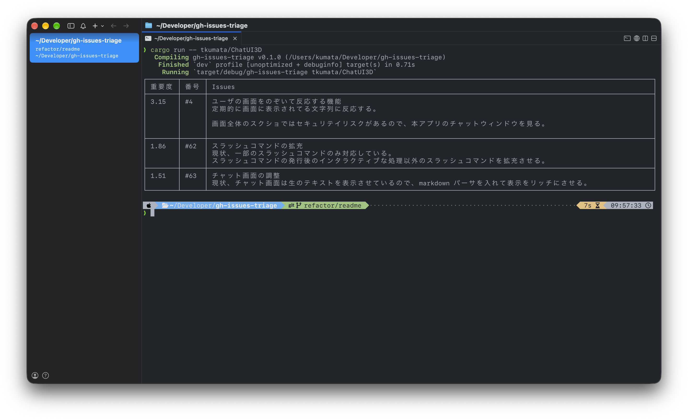

# GitHub Issues Triage

GitHub Issues の最新10件を取得し、Jev で重要度順に並べる CLI ツールです。

## Components

```text
               ┌─────────────────────┐
               │     GitHub App      │
               │                     │
               │ Client ID           │
               │ Permissions         │
               │ Installation        │
               └──────────┬──────────┘
                          │ enables
                          ▼
               ┌─────────────────────┐
               │     Device Flow     │
               │                     │
               │ User authorization  │
               │ Access token        │
               │ Refresh token       │
               └──────────┬──────────┘
                          │ access token
           ┌──────────────┴──────────────┐
           ▼                             ▼
┌─────────────────────┐       ┌─────────────────────┐
│   GitHub REST API   │       │  GitHub GraphQL API │
│                     │       │                     │
│ Issues              │       │ Issues              │
│ Repositories        │       │ Repositories        │
│ Users               │       │ Projects            │
└──────────┬──────────┘       └──────────┬──────────┘
           └──────────────┬──────────────┘
                          │ Issue data
                          ▼
               ┌─────────────────────┐
               │  gh-issues-triage   │
               └──────────┬──────────┘
                          │ Issue content
                          ▼
               ┌─────────────────────┐
               │        Jev          │
               │                     │
               │ Importance scoring  │
               └──────────┬──────────┘
                          │ Scores
                          ▼
               ┌─────────────────────┐
               │    Ranked Issues    │
               └─────────────────────┘
```

private repository を使う場合は、GitHub App を対象 repository に install し、App の `Issues: Read` 権限を設定してください。

## Environment

- Rust
- `reqwest` crate
- `GITHUB_CLIENT_ID`: GitHub App client ID（token 更新と Device Flow 用）
- `TYPESAFE_API_KEY`: TypeSafe Jev API key（Issue triage 用）

GitHub 公式 REST API を使って認証とデータの取得を行います。

## How to Use

```shell
export GITHUB_CLIENT_ID='<GitHub App client ID>'
export TYPESAFE_API_KEY='<TypeSafe API key>'
cargo run -- gh-username/gh-reponame
```

認証情報がない場合は Device Flow の確認 URL とコードを表示します。認証情報は macOS Keychain または Linux Secret Service に保存されます。保存済み access token が失効した場合は refresh token で自動更新し、refresh token がないか失効している場合だけ Device Flow を開始します。PAT と平文ファイルは使用しません。

repository 指定では、GitHub の open Issue を新しい順に最大10件取得し、pull request を除外します。全 Issue を1回の TypeSafe Jev リクエストで重要度判定、ブランチ名の分類、着手可能度の判定を行い、端末幅に合わせた Unicode 対応テーブルで表示します。

`Ready` 列は重要度とは独立した着手可能度を表示します。`Yes` は着手可能、`Needs information` は追加情報が必要、`Needs investigation` は実装前の技術調査が必要です。要求の具体性、必要な再現条件、完了条件、事前調査の必要性をタイトルと本文から判定します。情報不足と調査必要が重なる場合は情報不足を優先し、不具合以外には再現手順を必須にしません。Ready は重要度順やブランチ作成操作を変更しません。

Issue 番号の右隣には、対象ローカルリポジトリのブランチ状態を表示します。`🌿` はブランチあり、空欄はブランチなし、`?` は確認不能です。`refactor` / `fix` / `feat` / `chore` / `docs` のいずれかの prefix を持つ `issue-<number>` を照合し、リモート上だけのブランチや独自命名のブランチは対象に含めません。root 未設定などで確認できない場合も、理由を示して一覧を表示します。この画面で作成に成功した後は、一覧へ戻る際に状態を更新します。

ブランチ作成を使う場合は、ローカルプロジェクト群の親ディレクトリを先に設定します。

```shell
cargo run -- config set-root /absolute/path/to/projects
cargo run -- owner/repo
```

`owner/repo` のローカル対象は `<root>/repo` です。Issue 本文下のボタンをクリックするか、`1`〜`9`・`0`（10件目）でブランチを作成します。

Issue 一覧の操作は次のとおりです。

| 操作 | 動作 |
| --- | --- |
| マウスオーバー | ポインターのある Issue を仮選択。対象外へ移動すると解除 |
| `j` / 下矢印、`k` / 上矢印 | 次／前の Issue を仮選択し、必要なら自動スクロール。初回は先頭の表示 Issue を選択 |
| PageUp / PageDown | 画面単位でスクロールし、長い本文を閲覧 |
| `q` | 終了 |

仮選択した Issue は、タイトル・本文・ボタンを含むセル全体を ANSI 16色の薄い青（bright blue）背景・黒文字でハイライトします。枠線の色は変えません。マウス移動と仮選択キーの最後の操作に合わせて選択を切り替え、仮選択だけではブランチを作成しません。ブランチ作成結果の画面では、`j`/`k`・上下矢印は1行ずつスクロールします。

ブランチ名は `<prefix>/issue-<number>` で、対象リポジトリの `main` を起点にします。作成時に対象リポジトリを新しいブランチへ切り替えます。CLI の作業ディレクトリ変更と push は行いません。root は `XDG_CONFIG_HOME/gh-issues-triage/config.json`、未設定時は `~/.config/gh-issues-triage/config.json` に保存します。

GitHub または TypeSafe の応答、認証情報、端末幅の取得に失敗した場合は、途中結果を表示せず非ゼロで終了します。実 GitHub App の認証と TypeSafe API の確認は、自動テストとは別に行います。一覧のハイライトと操作は、2026-10-01 にユーザーが実端末で動作確認済みです。


